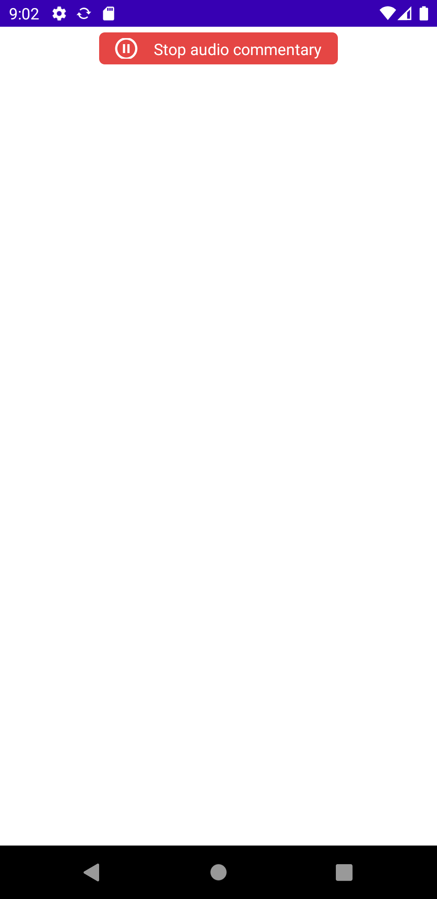

# gb vision player
component for live audio commentaries

 

[](https://jitpack.io/#alvitres01/gb_vision_player_android)

## Installation


```jitpack
dependencies {
	  implementation 'com.github.alvitres01:gb_vision_player_android:Release'
}
```

## How to use

Add view to your layout:

```xml
<com.gbvision.player.GbVisionPlayer
        android:id="@+id/player"
        android:layout_width="match_parent"
        android:layout_height="wrap_content" />
```

start player lifecycle in code
```kotlin
class MainActivity : AppCompatActivity() {

    lateinit var  gbVisionPlayer : GbVisionPlayer
    
    override fun onCreate(savedInstanceState: Bundle?) {
        super.onCreate(savedInstanceState)
        setContentView(R.layout.activity_main)
        gbVisionPlayer = findViewById(R.id.player)
    }

    override fun onResume() {
        super.onResume()
        gbVisionPlayer.onResume()
    }

    override fun onPause() {
        super.onPause()
        gbVisionPlayer.onPause()
    }

    override fun onDestroy() {
        super.onDestroy()
        gbVisionPlayer.onDestroy()
    }
}
```
